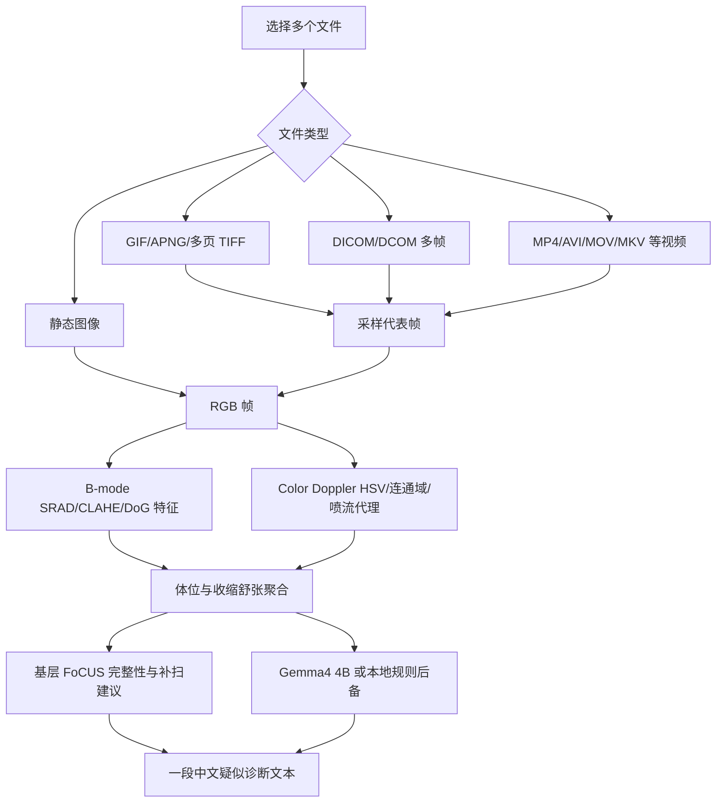

# CardioConsult PC Accuracy Improved Edition

CardioConsult PC Accuracy Improved Edition 是基于 Cine Edition 的正确率强化版，整合了此前三个 PC 方向：

1. 原 PC 版：多文件导入、DICOM/DCOM、离线 Gemma4 4B、本地规则后备、一段中文诊断输出。
2. 数学改进版：SRAD-inspired 散斑抑制、CLAHE-like 局部增强、Doppler 连通域、喷流宽度、方向一致性、散度/涡量代理。
3. 基层版：FoCUS 五切面完整性检查、图像质量提示、初学者补扫建议、基层复核/转诊安全分层。

本版本保留超声动图和视频兼容能力，并新增 CAMUS B-mode 低 EF 校准，用来强化“左心室收缩功能减低”的教学参考识别。输入输出合同仍与原 PC 版一致：

- 输入：用户选择一个或多个心脏超声媒体文件。
- 输出：一段中文疑似诊断/医学教学参考文本。
- 最大输入目标：标准心脏超声 12 个体位。
- 最小输入目标：任意一个体位的收缩态与舒张态。
- 模型：可离线调用本地 Gemma4 4B GGUF；模型不可用时使用规则后备。

> 重要说明：本项目面向医学教学、基层初筛参考和比赛原型，不是医疗器械，不作为临床最终诊断、治疗建议或医嘱。

## 本地目录

```text
D:\cardioconsult_PC_runbook
```

启动脚本：

```text
D:\cardioconsult_PC_runbook\run_cardio_pc_accuracy_improved.bat
```

第一次运行会自动创建 `.venv` 并安装依赖。

## 支持格式

### 静态图像

```text
.png
.jpg
.jpeg
.bmp
.tif
.tiff
.webp
.heic
.heif
```

### 动图 / 多帧图像

```text
.gif
.apng
.tif / .tiff 多页文件
animated .webp
```

动图会被自动拆成代表帧。默认每个 cine 文件最多采样 48 帧，避免一次导入过长视频导致内存占用过高。

### DICOM / DCOM

```text
.dcm
.dicom
.dcom
```

支持 pydicom 能解码的单帧和多帧 DICOM。依赖中加入了 `pylibjpeg`、`pylibjpeg-libjpeg` 和 `pylibjpeg-openjpeg`，用于提升 JPEG/JPEG2000 压缩 DICOM 的兼容性。但厂商私有封装、特殊视频对象或缺失转码插件的 DICOM 仍可能无法解析。

### 视频

```text
.mp4
.m4v
.mov
.avi
.mkv
.webm
.wmv
.mpg
.mpeg
.ts
.mts
.m2ts
.3gp
.cine
```

视频优先使用 `imageio` + `imageio-ffmpeg` 解码；如果用户额外安装了 `opencv-python-headless`，失败后还会回退到 OpenCV。由于不同设备导出的视频编码差异很大，实际兼容性取决于本机 FFmpeg/OpenCV 能否解码该文件。对于没有标准扩展名的文件，程序会依次尝试 DICOM、Pillow 图像解码和视频解码。

可选 OpenCV 回退安装：

```powershell
Set-Location D:\cardioconsult_PC_runbook
.\.venv\Scripts\python.exe -m pip install -r requirements-video-optional.txt
```

## 运行方式

双击：

```text
run_cardio_pc_accuracy_improved.bat
```

或命令行：

```powershell
Set-Location D:\cardioconsult_PC_runbook
.\run_cardio_pc_accuracy_improved.bat
```

自检：

```powershell
Set-Location D:\cardioconsult_PC_runbook
.\install_deps.bat
.\.venv\Scripts\python.exe app.py --self-test
```

## Gemma4 4B 模型

默认继续复用原 PC 版模型路径：

```text
D:\cardioconsult_PC_runbook\models\gemma-4-4b-it-Q4_K_M.gguf
D:\cardioconsult_PC_runbook\models\gemma-4-4b-mmproj-Q4_0.gguf
```

如果要启用真实离线 Gemma4 4B，需要在 UI 中配置 `llama-cli.exe`。如果没有模型或 `llama-cli.exe`，程序仍会输出本地规则后备诊断。

## Cine 处理策略

超声动图通常比单张图更适合判断收缩/舒张相位，但它也会带来计算量和格式兼容问题。因此本版本采用轻量策略：

1. 对 GIF/APNG/多页 TIFF/多帧 DICOM/视频进行帧采样。
2. 每个 cine 文件最多保留 48 帧。
3. 每帧统一转为 RGB 矩阵。
4. 进入原有 `StudyAnalysis` 流程。
5. 如果文件名没有 ED/ES/收缩/舒张，程序会在同一体位内用腔室面积代理自动寻找最小帧和最大帧，分别作为收缩态和舒张态后备。

这使得输入一段 `A4C.mp4`、`PLAX.gif` 或多帧 DICOM 时，程序仍可自动得到收缩/舒张代理并输出一段诊断文本。

## 整合后的算法流程



## UI 改动

相较于原 PC 版：

- “添加 PNG/DICOM”按钮改为“添加图像/动图/视频/DICOM”。
- 文件选择器增加视频和动图格式。
- 分析摘要会显示媒体类型，例如 `raster`、`animated_image`、`dicom`、`video`。
- 保留基层提示栏：
  - FoCUS 五切面完整性
  - 图像质量等级
  - 补扫建议
  - 安全分层

## 推荐命名

为了提高体位识别和相位识别准确性，建议文件名包含体位和相位：

```text
A4C_cine.mp4
A4C_ED.png
A4C_ES.png
PLAX_loop.gif
PSAX_PM.dcm
SUBCOSTAL_4C_cine.avi
IVC_mmode.mp4
A5C_color_doppler.mov
```

相位关键词：

```text
ED, ES, diastole, systole, end_diastole, end_systole, 舒张, 收缩
```

体位关键词：

```text
PLAX, PSAX-AV, PSAX-MV, PSAX-PM, PSAX-APEX, A4C, A5C, A2C, A3C, SUBCOSTAL-4C, IVC, SUPRASTERNAL
```

## 当前仍然做不到的事情

- 不能保证每一种厂商私有 DICOM 或视频编码都能打开。
- 不能从压缩视频恢复真实 DICOM 标尺、速度标尺、PRF 或 Nyquist limit。
- 不能真实计算 EF、EDV、ESV、压力阶差或反流定量。
- 视频帧采样不是完整心动周期追踪。
- 没有临床验证，不能替代正式超声报告。

## 后续建议

如果继续推进，最值得做的是：

- 用轻量模型做自动体位分类，减少对文件名的依赖。
- 增加视频级心动周期检测，而不是只采样代表帧。
- 增加心内膜分割和 EF 估计，但必须用标注数据验证。
- 增加本地转诊流程、常见切面示意图和初学者教学卡片。
- 将 Gemma4 4B prompt 改为检索增强，引用本地离线指南库。

## 本版基于测试结果的强化

本目录是在 PC Cine 版基础上的正确率强化版，重点针对密集验证中暴露出的 CAMUS 端到端问题：旧规则在 EF<50 的样本上过于保守，导致低收缩功能病例大量被输出为“未见明确心脏超声异常”。

已加入的改进：

- 复用 `D:\cardioconsult_dense_validation\results\CAMUS\features.csv` 训练了 B-mode 低 EF 代理校准器。
- 校准文件保存在 `calibration/camus_low_ef_bmode.json`，运行时不依赖 scikit-learn，只读取 JSON 系数。
- 新增相对收缩幅度代理 `contractility_fraction_proxy`，用于比单纯 ED/ES 面积差值更稳地描述收缩幅度。
- 当 A2C/A3C/A4C 等左室相关切面具备收缩/舒张配对，且 CAMUS B-mode 校准概率超过阈值时，规则后备会优先输出“左心室收缩功能减低”。
- 保留原有 Doppler 反流/狭窄规则；若彩色血流证据明确，仍优先输出精确瓣膜病症判断。

当前校准器在 CAMUS case-level 交叉验证中的参考结果：

| 指标 | 数值 |
|---|---:|
| AUC | 0.688 |
| Accuracy | 0.728 |
| Balanced accuracy | 0.635 |
| Positive F1 | 0.817 |

如果需要基于新的验证结果重训校准器，可在安装过 `pandas` 和 `scikit-learn` 的环境中运行：

```powershell
Set-Location D:\cardioconsult_PC_runbook
D:\cardioconsult_dense_validation\.venv\Scripts\python.exe .\tools\train_camus_low_ef_calibration.py
```

## 数据安全

请只导入脱敏后的教学或比赛数据。不要把真实患者隐私数据、DICOM 原始数据、导出报告或 GGUF 模型提交到 GitHub。
