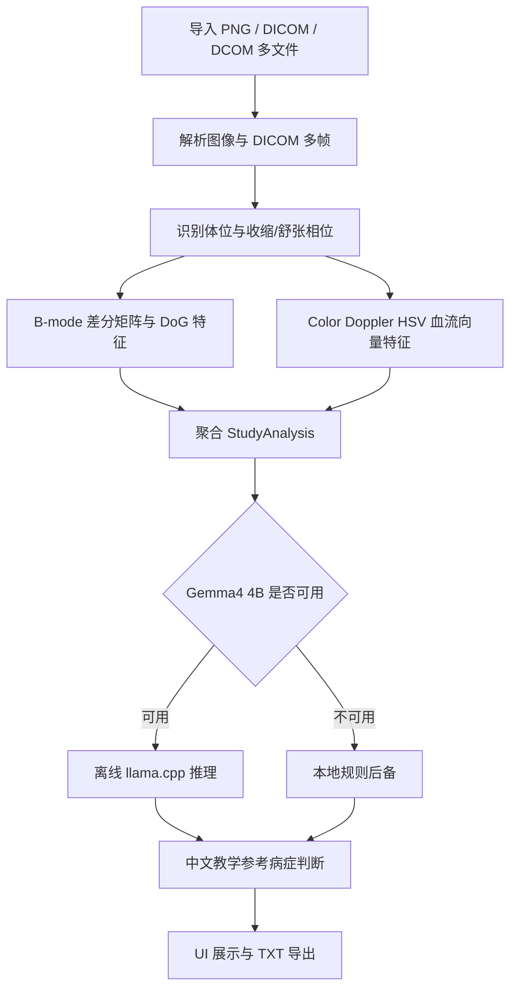

# CardioConsult PC

CardioConsult PC 是一个面向医学教学与算法演示的 Windows 桌面端心脏超声辅助分析原型。项目用于读取脱敏后的心脏超声图像文件，执行本地边缘计算特征提取，并输出一段中文“教学参考病症判断”。系统支持在没有网络的情况下运行；当本机配置了离线 Gemma4 4B GGUF 模型与 `llama-cli.exe` 时，会调用本地模型生成诊断文字；当模型尚未配置时，程序仍可运行，并使用确定性的本地规则后备输出明确病症标签。

> 重要说明：本项目仅用于医学教学、比赛演示和算法验证，不作为临床最终诊断、治疗建议或医嘱。任何正式医学判断都需要结合完整标准切面、DICOM 标尺、连续动态帧、病史、体征和超声医师报告。

## 项目定位

本项目对应一个离线运行的 PC 版 CardioConsult 设备软件原型。它的目标不是替代医生，而是把心脏超声教学中的“多人会诊式思路”拆解为可演示的本地流程：

1. 导入脱敏心脏超声图像。
2. 自动聚合多张图像或 DICOM 多帧数据。
3. 自动估计体位、收缩态与舒张态。
4. 提取 B-mode 结构特征与 Color Doppler 血流向量特征。
5. 使用 Gemma4 4B 离线模型或本地规则后备生成中文教学参考判断。
6. 输出明确到病症名称的疑似诊断文字。

## 核心功能

- Windows 桌面 UI。
- 支持多文件同时导入。
- 支持 PNG、JPG、BMP、TIFF 等常见图像格式。
- 支持 DICOM/DCOM：`.dcm`、`.dicom`、`.dcom`。
- 支持 DICOM 多帧解析。
- 最大输入目标：标准心脏超声 12 个体位。
- 最小输入目标：任意一个体位的收缩态与舒张态。
- 自动识别常见体位标签，例如 PLAX、PSAX、A4C、A5C、A2C、A3C 等。
- 自动区分收缩态和舒张态：优先使用文件名，缺失时使用腔室面积代理。
- B-mode 图像处理：灰度归一化、差分矩阵、DoG 增强、边缘密度、纹理熵、腔室面积代理。
- Color Doppler 图像处理：HSV 血流向量转换、活跃区比例、方向代理、湍流代理、涡量代理。
- 离线 Gemma4 4B 推理入口。
- 模型缺失时仍可使用本地规则后备。
- 输出可导出为 `.txt` 报告。

## 可输出的教学参考病症标签

当前规则后备与 Gemma4 4B prompt 会优先输出具体病症名称，而不是只输出“异常”或“瓣膜病变”这类笼统描述。示例包括：

- 轻度二尖瓣反流
- 轻度三尖瓣反流
- 中度二尖瓣反流
- 中度三尖瓣反流
- 轻度主动脉瓣反流
- 主动脉瓣轻度狭窄倾向
- 肺动脉瓣轻度反流
- 左心室收缩功能减低
- 节段性室壁运动异常
- 图像证据不足，倾向未见明确异常
- 未见明确心脏超声异常

这些标签是为了教学演示而设计的明确输出，不代表经过临床验证的诊断系统。

## 推荐运行环境

### 最低环境

- Windows 10 或 Windows 11
- Python 3.10 及以上
- 8 GB RAM
- 2 GB 可用磁盘空间

### 推荐环境

- Windows 11
- Python 3.11 或 3.12
- 16 GB RAM 或更高
- 10 GB 以上可用磁盘空间
- 将项目放在 D 盘，避免占用 C 盘空间

### 离线 Gemma4 4B 推荐环境

- 16 GB RAM 起步，推荐 24 GB 或更高
- 使用量化 GGUF 模型，例如 Q4 系列
- 本地准备 `llama-cli.exe`
- 模型文件放在项目的 `models` 目录中

## 快速开始

建议将项目部署在 D 盘：

```bat
cd /d D:\
git clone https://github.com/Timmy-zhu12/gdc-shanghai-project.git cardioconsult_PC_runbook
cd /d D:\cardioconsult_PC_runbook
```

安装依赖：

```bat
D:\cardioconsult_PC_runbook\install_deps.bat
```

启动程序：

```bat
D:\cardioconsult_PC_runbook\run_cardio_pc.bat
```

运行自检：

```bat
cd /d D:\cardioconsult_PC_runbook
.venv\Scripts\python.exe app.py --self-test
```

自检会生成两张合成 A4C 示例图，并输出一段教学参考诊断文字。即使没有安装 Gemma4 4B 模型，自检也应当可以通过。

## 离线 Gemma4 4B 配置

程序默认查找以下模型路径：

```text
D:\cardioconsult_PC_runbook\models\gemma-4-4b-it-Q4_K_M.gguf
D:\cardioconsult_PC_runbook\models\gemma-4-4b-mmproj-Q4_0.gguf
```

其中 `gemma-4-4b-it-Q4_K_M.gguf` 是文本推理模型文件。`gemma-4-4b-mmproj-Q4_0.gguf` 是预留的多模态投影文件路径，当前 PC 版主要把边缘计算特征整理为文本 prompt 交给本地模型。

在 UI 中配置：

1. 选择本机的 `llama-cli.exe`。
2. 确认模型路径指向 `models` 目录下的 Gemma4 4B GGUF 文件。
3. 点击分析。

如果 `llama-cli.exe` 或 GGUF 模型不存在，系统会显示规则后备模式，并继续输出教学参考病症判断。

## 输入文件规范

支持格式：

```text
.png
.jpg
.jpeg
.bmp
.tif
.tiff
.dcm
.dicom
.dcom
```

推荐文件命名方式：

```text
A4C_ED.png
A4C_ES.png
PLAX_ED.png
PLAX_ES.png
A5C_color_doppler.png
```

常用相位关键词：

- 舒张态：`ED`、`diastole`、`diastolic`、`end_diastole`、`舒张`
- 收缩态：`ES`、`systole`、`systolic`、`end_systole`、`收缩`

常用体位关键词：

- `PLAX`：胸骨旁左室长轴
- `PSAX-AV`：主动脉瓣短轴
- `PSAX-MV`：二尖瓣短轴
- `PSAX-PM`：乳头肌短轴
- `A4C`：心尖四腔心
- `A5C`：心尖五腔心
- `A2C`：心尖二腔心
- `A3C`：心尖三腔心
- `SUBCOSTAL-4C`：剑突下四腔心
- `IVC`：下腔静脉
- `SUPRASTERNAL`：胸骨上窝

如果文件名不包含体位或相位，程序会尽量通过图像代理特征进行聚合，但置信度会降低。

## 软件工作流



## 数学与边缘计算框架

### B-mode

B-mode 图像会先转换为灰度矩阵，并进行鲁棒归一化。系统随后计算差分矩阵和 Difference of Gaussians 增强图，以提取结构与边界信息。

主要特征包括：

- 灰度均值
- 灰度方差
- 横向差分均值
- 纵向差分均值
- 梯度强度
- 边缘密度
- 纹理熵
- DoG 均值
- DoG 高响应比例
- 腔室面积代理

腔室面积代理用于帮助判断同一体位中的收缩态与舒张态。通常舒张态腔室面积更大，收缩态腔室面积更小。

### Color Doppler

Color Doppler 图会被转换到 HSV 空间。系统使用饱和度与亮度估计血流活跃程度，并将 hue 映射为简化方向角，形成二维血流向量场：

```text
speed = saturation * value
vx = speed * cos(theta)
vy = speed * sin(theta)
```

主要特征包括：

- 朝向探头代理比例
- 远离探头代理比例
- 平均速度代理
- 有符号方向代理
- 血流活跃区比例
- 湍流代理
- 梯度能量
- 散度代理
- 涡量代理
- 置信度代理

这些特征用于教学级别的模式判断，例如轻度瓣膜反流、主动脉瓣狭窄倾向、室壁运动异常等。

## 输出示例

程序输出为一段中文自然语言，例如：

```text
教学参考病症判断：左心室收缩功能减低。本次输入包含 2 个文件/帧，覆盖约 1 个体位，系统自动识别出 1 个舒张态、1 个收缩态；判断依据为：收缩态与舒张态腔室面积代理差值偏低，提示教学参考下的收缩幅度不足。B-mode 边缘密度 0.018、纹理熵 0.721、收缩舒张腔室面积代理差值 0.022；Color Doppler 活跃区比例 0.024、湍流代理 0.006、涡量代理 0.004。综合当前体位覆盖、相位识别和边缘计算特征，本次教学参考置信度为中低。该结论是为了医学教学和算法演示而给出的明确参考判断，不作为临床最终诊断、治疗建议或医嘱。
```

## 项目目录

```text
cardioconsult_PC_runbook/
├── app.py                         # 程序入口与自检
├── install_deps.bat               # 创建虚拟环境并安装依赖
├── run_cardio_pc.bat              # 启动桌面 UI
├── requirements.txt               # Python 依赖
├── config.example.json            # 配置示例
├── CardioConsult_PC_runbook.md    # 简明运行手册
├── cardio_pc/
│   ├── imaging.py                 # PNG/DICOM 文件加载
│   ├── features.py                # B-mode 与 Doppler 特征提取
│   ├── diagnosis.py               # Gemma4 prompt 与规则后备
│   └── ui.py                      # Tkinter 桌面界面
├── models/
│   └── README.md                  # 模型放置说明
├── samples/
│   ├── A4C_ED_synthetic.png       # 自检样例
│   └── A4C_ES_synthetic.png       # 自检样例
└── exports/
    └── .gitkeep                   # 报告导出目录
```

## 依赖

```text
numpy
Pillow
pydicom
```

`install_deps.bat` 会在项目目录下创建 `.venv`，依赖不会写入系统 Python 环境。

## 数据与隐私

- 项目设计为处理脱敏后的教学或比赛数据。
- 不需要上传病人数据到云端。
- Gemma4 4B 推理可在本地离线执行。
- 导出的报告默认保存在项目 `exports` 目录。
- 请不要将真实患者隐私数据提交到 GitHub。

## GitHub 与大文件说明

仓库地址：

```text
https://github.com/Timmy-zhu12/gdc-shanghai-project
```

以下内容不会提交到 GitHub：

- `.venv/`
- `config.json`
- `exports/` 中生成的报告
- `models/` 中的 GGUF 大模型文件

如需共享模型，请使用单独的模型发布渠道或比赛允许的大文件存储方式。

## 已知限制

- 本项目是教学原型，不是医疗器械。
- 规则阈值没有经过大规模临床验证。
- 若输入只有单张图，系统仍会输出参考判断，但置信度会较低。
- 部分压缩 DICOM 可能需要额外解码库支持。
- Color Doppler 的真实速度标尺、Nyquist limit、探头角度和别名效应没有被完整建模。
- 离线 Gemma4 4B 的输出质量取决于本地模型文件、量化精度和运行后端。

## 开发计划

- 增加更多标准心超体位的样例数据。
- 增加真实 DICOM cine loop 的批量验证。
- 增加专家标注对照集。
- 增加病例级别的结构化报告模板。
- 接入更完整的本地多模态 Gemma4 4B 推理后端。
- 与 Android 版保持同源诊断规则和输入规范。

## 许可证与责任

本项目用于医学教学、科研原型和比赛演示。使用者需要确保输入数据已经脱敏，并遵守所在机构、比赛和当地法规的伦理要求。项目输出不得直接用于临床诊断、治疗决策或患者管理。

本仓库原创代码、脚本、UI、配置与文档采用 Apache License 2.0 发布，详见 [LICENSE](LICENSE)。

注意：该许可证不覆盖第三方模型权重、GGUF 文件、移动/桌面系统 SDK、超声软件、医学影像数据集、第三方商标或用户提供的教学/临床数据；这些内容仍受其各自许可、平台条款或伦理/机构授权约束。详细边界见 [NOTICE](NOTICE)。
