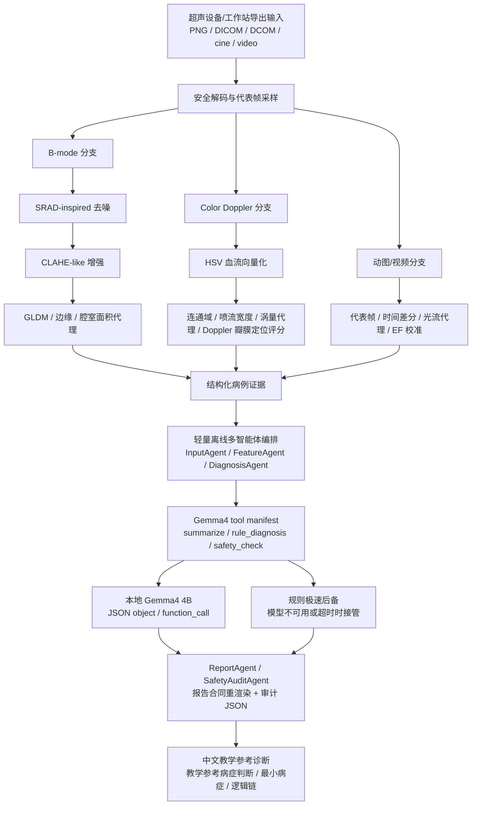

# 架构说明

CardioConsult PC V5 使用“边缘视觉证据 -> Gemma4 4B 本地推理 -> 报告合同与安全审计”的离线架构。PC V5 被定义为超声机器旁的离线分析终端，可从超声设备、无线超声软件、DICOM 工作站或导出共享目录直接读取资料。

## 核心原则

- Gemma4 4B 是主智能层，负责结构化证据推理、函数调用、层级诊断组织和中文报告生成。
- 规则层是 Gemma4 的本地工具链和安全后备，不是独立替代叙事。
- PC V5 不上传原始病人图像，不依赖云端服务。
- 输入输出合同固定：输入脱敏心超图像/动图/DICOM，输出中文教学参考诊断。
- 模型不可用、输出不完整或超时时，系统仍必须输出可审计规则报告。
- 所有报告必须保留医学教学用途和非临床诊断声明。
- 多智能体审计链只做本地摘要、决策复用、报告合同检查和安全审计，不额外联网。

## 运行角色

| 模块 | 角色 |
|---|---|
| `image_io` | 安全读取 PNG、DICOM/DCOM、动图和视频，执行代表帧采样与超时保护 |
| `features` | 提取 B-mode、Color Doppler、动图差分、纹理和光流代理特征 |
| `diagnosis` | 生成层级候选病症、规则诊断、报告合同重渲染和安全声明 |
| `function_calling` | 暴露 Gemma4 可调用的本地白名单工具 |
| `agents` | 串联 InputAgent、FeatureAgent、DiagnosisAgent、ReportAgent、SafetyAuditAgent |
| `ui` | 提供文件导入、推理模式切换、一键规则匹配、取消分析和报告展示 |

## 平台边界

当前 Windows PC V5 是唯一积极维护的参考实现。其他平台原型可以复用 `shared/diagnostic_contract.md` 中的输入输出合同，但不作为当前复现的必要条件。
