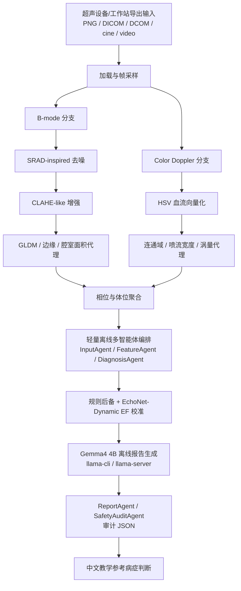

# 架构

CardioConsult 使用双分支边缘计算流水线，然后调用离线 Gemma4 4B 层，把结构化证据转换为中文教学参考诊断。PC V5 被定位为超声机器旁的离线分析终端，可从超声设备、无线超声软件、DICOM 工作站或导出共享目录直接读取资料。

核心设计原则：

- Windows PC V5 是当前参考实现，代码发布在 `Timmy-zhu12/gdc-shanghai-project`，本仓库也是当前提交入口。
- PC V5 不是云端后台，而是检查室或基层医疗点内的离线分析设备，可通过 USB、局域网共享目录、DICOM 工作站导出目录或无线超声软件导出文件直接接入超声工作流。
- PC V5 使用轻量离线多智能体编排：各 agent 只做本地摘要、决策复用和安全审计，不额外联网，也不额外多次调用 Gemma4。
- PC V5 使用本地 GGUF；优先支持常驻 `llama-server` 复用，也保留 `llama-cli` 与规则后备。
- 后续平台迁移应保持与 `shared/diagnostic_contract.md` 一致的输入输出合同。
- 模型不可用时必须仍能输出本地规则后备诊断。
- 所有报告必须保留医学教学用途和非临床诊断声明。
