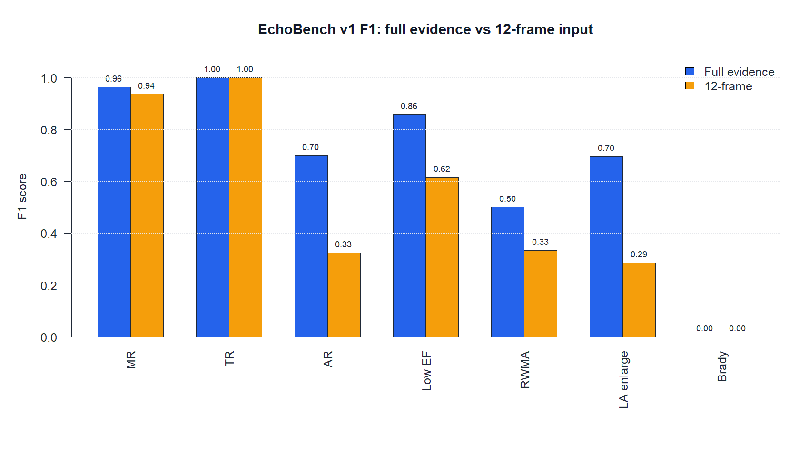
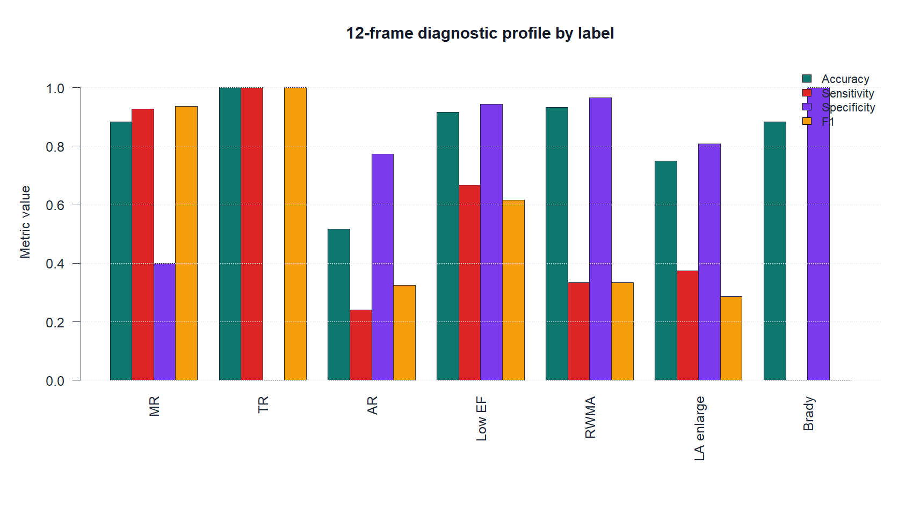
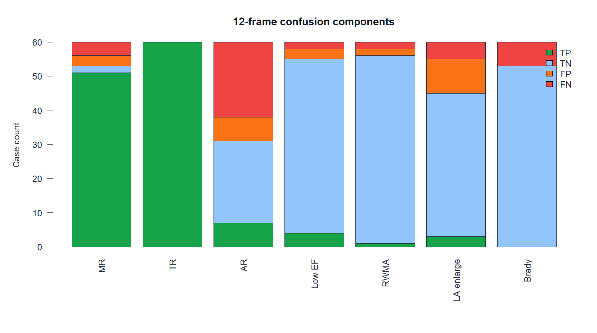
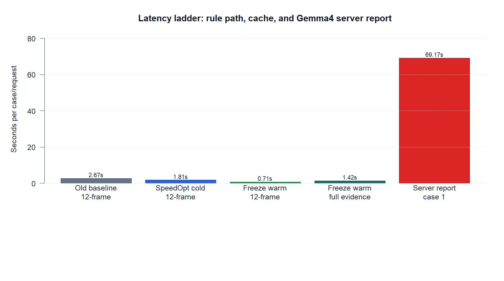
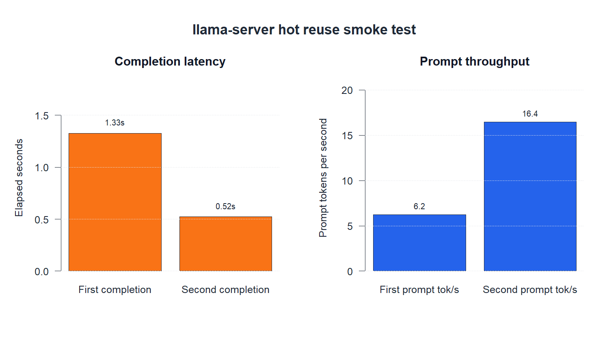
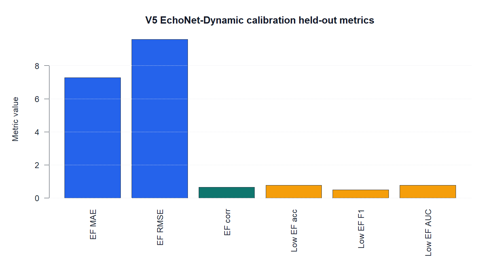
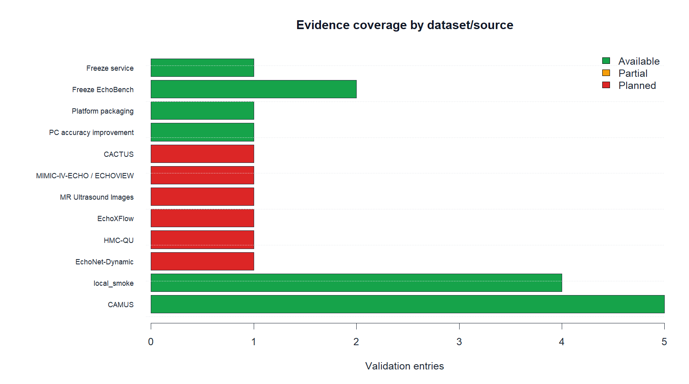
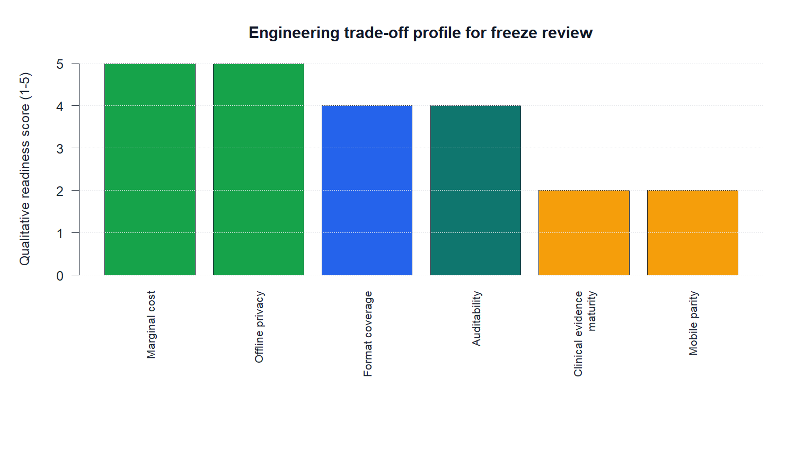

# CardioConsult PC V5 冻结版技术报告（APA 引用版）

生成日期：2026-06-04

系统版本：CardioConsult PC V5 freeze build `2026-06-04`

定位：超声机器旁离线分析设备；医学教学、算法演示与基层参考工具，不是医疗器械。

## 摘要

CardioConsult PC V5 解决的问题是：在缺少心脏超声专科医生、网络条件有限或需要保护教学/脱敏病例数据的场景中，如何让超声初学者和基层医疗点从 PNG、DICOM/DCOM、cine/视频等文件中获得一份可解释、可审计、不会冒充正式诊断的心脏超声教学参考结果。系统把 PC 定义为接在超声机器、无线超声软件、DICOM 工作站或局域网导出目录旁的离线分析终端；所有图像预处理、特征提取、层级标签、轻量多智能体审计和 Gemma4 4B GGUF 文本生成都在本机完成。

冻结前检查显示，当前仓库可以完成三类任务：第一，规则路径 `app.py --self-test-rule-only` 通过，输出包含 `教学参考病症判断：`、`最小病症：`、`逻辑链：` 和安全边界；第二，授权本地 60 例 EchoBench 完整证据场景 60/60 成功，平均 1.418 秒/例，MR F1=0.964、AR F1=0.700、低 EF F1=0.857；第三，12 帧代表输入场景 60/60 成功，warm-cache 平均 0.711 秒/例，MR F1=0.936、AR F1=0.326、低 EF F1=0.615。本地 `llama-server` 项目链路第 1 例服务模式诊断耗时 69.168 秒，报告保护层记录 `Gemma4 4B offline server: http://127.0.0.1:8088 (Gemma4 output received; report guard repaired required fields)`，最终输出 `has_prompt_leakage=false`、`report_source=gemma4_repaired`。

从评委视角看，V5 的强项不是单一公开排行榜最高分，而是低成本可运行、输入格式兼容、输出合同明确、审计链完整、隐私边界清楚。它的主要风险也清楚：AR、RWMA、左房扩大和严重程度分级在 12 帧输入下仍受切面覆盖影响；当前 60 例报告链接标签不是多专家盲评金标准；系统不能作为临床诊断或治疗建议。这个边界在 UI、README、技术报告和诊断输出中均需保留。

## 1. 问题陈述与用户价值

基层医疗点和超声初学者常见困难不是“完全没有图像”，而是有图像、有 DICOM 或无线超声导出文件，却缺少稳定的心脏超声专科解读、补扫建议和教学级复盘。传统多人会诊依赖专家时间和网络条件；云端多模态模型又会带来隐私、成本、网络和部署不确定性。CardioConsult V5 的目标是提供一个离线、低边际成本、可审计的教学参考层，把系统输出限制在“疑似病症判断、证据链、补扫建议、安全分层”上。

医学边界上，本项目遵循良好机器学习实践中关于目标人群、数据代表性、开发追溯、性能监测和人类监督的原则（FDA, Health Canada, & Medicines and Healthcare products Regulatory Agency, 2021）。工程边界上，它借鉴 MLPerf 对客户端、离线和服务场景的分层测量思路，但 EchoBench v1 是项目自建 benchmark，不是 MLCommons 官方提交（MLCommons, n.d.-a, n.d.-b）。

## 2. 系统方案

系统分为五层：输入层读取 PNG/JPG、DICOM/DCOM、多帧 TIFF、GIF、MP4/MOV/AVI 等文件；B-mode 分支计算 SRAD/CLAHE 风格预处理、边缘密度、纹理熵、散斑残差、腔室面积代理和收缩舒张差；Color Doppler 分支将 HSV 血流颜色转为活跃区、连通域、喷流宽度、方向一致性、湍流和涡量代理；校准层用 V4 shared-EK/coupled-EK 与 V5 EchoNet-Dynamic 校准增强 EF / 左室收缩功能减低；报告层用规则或 Gemma4 4B GGUF 生成中文教学摘要，并由报告保护层清除提示词泄漏、截断和 AI 口吻。

EchoNet-Dynamic 是公开心超视频数据集，包含心尖四腔视频和 EF/ESV/EDV/左室追踪标注，适合用于心功能任务（Ouyang et al., 2020）。CAMUS 则适合 2D 心超分割和腔室结构评估（Leclerc et al., 2019）。瓣膜反流和腔室定量的正式临床判断仍应遵循 ASE/EACVI 指南，而不能只依赖本项目的颜色代理特征（Lang et al., 2015; Zoghbi et al., 2017）。

## 3. Benchmark 设计

冻结版报告采用四组证据：

1. **规则自检。** 本地 synthetic A4C ED/ES 输入，验证文件读取、特征提取、层级标签、自然化报告和安全边界。
2. **EchoBench 完整证据。** 60 例授权 DICOM/报告时间映射，每例读取全部可用文件，衡量资料充分时的系统上限。
3. **EchoBench 12 帧代表输入。** 每例最多 12 个文件/帧，模拟产品输入上限和现场演示限制。
4. **本地服务。** 常驻 `llama-server` 加载 Gemma4 4B GGUF，测 `/completion` 热启动复用和项目级服务诊断链路。

医疗项目指标包括准确率、敏感性、特异性、精确率、F1、EF MAE/RMSE/相关系数、报告安全字段、补扫提示和人工复核边界。一般工程指标包括启动可用性、每例延迟、P50/P90/P95/P99、热启动复用、边际调用成本、离线隐私、审计链和可复现命令。

## 4. 主要性能结果

### 4.1 完整证据：标签性能

完整证据场景 60/60 例成功，平均 1.418 秒/例，P95=2.499 秒。MR、TR、低 EF 表现稳定；AR 中等；RWMA、心动过缓等标签因为样本少或未接入 ECG/完整报告结构化字段，不能过度宣称。



| 标签 | n | 阳性 | TP | TN | FP | FN | 准确率 | 敏感性 | 特异性 | F1 |
| --- | ---: | ---: | ---: | ---: | ---: | ---: | ---: | ---: | ---: | ---: |
| 二尖瓣反流 MR | 60 | 55 | 53 | 3 | 2 | 2 | 0.933 | 0.964 | 0.600 | 0.964 |
| 三尖瓣反流 TR | 60 | 60 | 60 | 0 | 0 | 0 | 1.000 | 1.000 | 0.000 | 1.000 |
| 主动脉瓣反流 AR | 60 | 29 | 21 | 21 | 10 | 8 | 0.700 | 0.724 | 0.677 | 0.700 |
| 低 EF / 左室收缩功能减低 | 60 | 6 | 6 | 52 | 2 | 0 | 0.967 | 1.000 | 0.963 | 0.857 |
| 节段性室壁运动异常 RWMA | 60 | 3 | 1 | 57 | 0 | 2 | 0.967 | 0.333 | 1.000 | 0.500 |
| 左房扩大 | 60 | 8 | 8 | 45 | 7 | 0 | 0.883 | 1.000 | 0.865 | 0.696 |
| 心动过缓 | 60 | 7 | 0 | 53 | 0 | 7 | 0.883 | 0.000 | 1.000 | 0.000 |

注：TR 在本批 60 例中全部为阳性，因此特异性没有统计解释价值。

### 4.2 12 帧输入：现场演示上限

12 帧代表输入场景 60/60 例成功，warm-cache 平均 0.711 秒/例，P95=0.763 秒。MR F1 仍为 0.936，低 EF F1 为 0.615；AR F1 降至 0.326，提示主动脉瓣反流需要更完整的 A5C/主动脉瓣相关切面和彩色多普勒序列。



| 标签 | n | 阳性 | TP | TN | FP | FN | 准确率 | 敏感性 | 特异性 | F1 |
| --- | ---: | ---: | ---: | ---: | ---: | ---: | ---: | ---: | ---: | ---: |
| 二尖瓣反流 MR | 60 | 55 | 51 | 2 | 3 | 4 | 0.883 | 0.927 | 0.400 | 0.936 |
| 三尖瓣反流 TR | 60 | 60 | 60 | 0 | 0 | 0 | 1.000 | 1.000 | 0.000 | 1.000 |
| 主动脉瓣反流 AR | 60 | 29 | 7 | 24 | 7 | 22 | 0.517 | 0.241 | 0.774 | 0.326 |
| 低 EF / 左室收缩功能减低 | 60 | 6 | 4 | 51 | 3 | 2 | 0.917 | 0.667 | 0.944 | 0.615 |
| 节段性室壁运动异常 RWMA | 60 | 3 | 1 | 55 | 2 | 2 | 0.933 | 0.333 | 0.965 | 0.333 |
| 左房扩大 | 60 | 8 | 3 | 42 | 10 | 5 | 0.750 | 0.375 | 0.808 | 0.286 |
| 心动过缓 | 60 | 7 | 0 | 53 | 0 | 7 | 0.883 | 0.000 | 1.000 | 0.000 |



### 4.3 延迟、缓存和本地服务

SpeedOpt 前 12 帧基线平均 2.670 秒/例；SpeedOpt 冷缓存平均 1.813 秒/例；冻结版 warm-cache 12 帧平均 0.711 秒/例，相比旧基线下降 73.4%。完整证据 warm-cache 平均 1.418 秒/例，说明当前普通 PC 上已经可以支撑交互式教学演示。



| 场景 | 平均秒/例 | P50 | P90 | P95 | P99 | 最大值 | 平均文件数 |
| --- | ---: | ---: | ---: | ---: | ---: | ---: | ---: |
| 完整证据 warm-cache | 1.418 | 1.107 | 2.225 | 2.499 | 3.105 | 3.394 | 17.283 |
| 12帧 warm-cache | 0.711 | 0.705 | 0.749 | 0.763 | 0.858 | 0.986 | 12.000 |
| 12帧 SpeedOpt 冷缓存 | 1.813 |  |  |  |  |  | 12.000 |
| 12帧旧基线 | 2.670 |  |  |  |  |  | 12.000 |

本地服务 smoke 连续两次 `/completion` 均返回 OK：第一次 1.327 秒，第二次 0.522 秒。第二次请求 prompt tok/s 从 6.22 提升到 16.44，说明常驻模型复用有效。



项目级服务链路使用 EchoBench 第 1 例、12 个文件、`max_tokens=240`：文件加载 0.902 秒，特征提取 0.011 秒，Gemma4 服务诊断 69.168 秒；报告保护层启用，最终 `has_prompt_leakage=false`、`report_source=gemma4_repaired`，并保留医学安全边界。

### 4.4 EchoNet-Dynamic 校准层

V5 的 EchoNet-Dynamic 校准层用于补强 EF 和左室收缩功能减低识别，不替代瓣膜反流规则。held-out 指标为 EF MAE=7.271、EF RMSE=9.603、EF 相关系数=0.647、低 EF AUC=0.764、低 EF F1=0.496。这支持“教学提示”用途，但不足以宣称临床 EF 自动测量。



## 5. 数据来源与证据覆盖

本仓库不分发原始 DICOM、公开数据集压缩包或 GGUF 权重，只保存汇总报告、指标和图表。CAMUS、EchoNet-Dynamic、HMC-QU、EchoXFlow、MR Ultrasound Images、MIMIC-IV-ECHO/ECHOVIEW、CACTUS 等来源按许可证或访问条件分级记录在 `DATASETS.md` 和 `integrated_test_results.*`。从冻结评审角度，最强证据是授权本地 60 例、CAMUS 阶段测试、本地 smoke 和服务链路；计划数据集只能写成后续路线，不能包装成已完成结果。



## 6. 与现有方案的比较

EchoNet-Dynamic 和 CAMUS 这类公开方案的优势是任务定义清晰、数据结构规范、适合学术复现；限制是通常聚焦 EF、容积或分割，不直接覆盖基层教学场景中的 DICOM/DCOM 兼容、Color Doppler 代理、中文层级病症报告和离线本地部署（Leclerc et al., 2019; Ouyang et al., 2020）。云端多模态模型可能具备更强的自然语言解释能力，但会引入病例上传、网络、费用、审计和服务可用性问题。

CardioConsult V5 的差异化是：输入侧兼容真实超声导出文件；算法侧融合 B-mode、Color Doppler、动图差分和 EchoNet 校准；输出侧强制最小病症、逻辑链和安全边界；运行侧采用本地规则、小模型与 GGUF LLM，边际调用成本接近 0。代价是部分细粒度病症在缺切面时准确率下降，需要明确补扫和复核。

## 7. 成本模型与取舍

本地方案的主要成本是一次性 PC、存储和 GGUF 文件准备。运行时不按病例调用云 API，规则路径吞吐可按每小时数百到上千例估算；真实演示受人工选文件、磁盘、DICOM 解码和 GGUF 文本 token 数影响。以冻结版 warm-cache 为例，12 帧规则链路平均 0.711 秒/例，理论吞吐约 5063 例/小时；完整证据平均 1.418 秒/例，理论吞吐约 2539 例/小时。



主要取舍如下：

- 为了离线和低成本，牺牲了云端大模型的算力弹性。
- 为了可审计和安全，核心标签由规则/校准层给出，LLM 主要负责表达，牺牲了部分自由生成能力。
- 为了兼容 DICOM/DCOM 和动图，保留了较复杂的文件解析与代表帧抽样。
- 为了提高基层筛查敏感性，低 EF 等标签更偏向“提示/待排”，正常特异性需要更多阴性样本继续优化。

## 8. 冻结前补救与评审风险

本轮冻结检查完成了以下补救：

1. 删除无用或容易打不开的高级 BAT，只保留 `install_deps.bat` 和 `run_cardio_pc_v5.bat` 两个普通入口。
2. 修正诊断链输出保护层，清除提示词泄漏、markdown 模板和“作为 AI / 我将”式口吻。
3. 更新本地服务 JSON，旧的提示词泄漏片段已被干净报告替换。
4. 重跑 60 例完整证据和 12 帧冻结 benchmark。
5. 用 R 生成 8 张报告图，并同步到 submission 与 docs。
6. 报告中明确写出医学边界、数据许可、未下载数据集和不可过度宣称的标签。

仍需诚实呈现的风险：

- 当前 60 例是本地授权教学数据，不是多中心外部临床验证。
- 报告链接标签不是多专家盲评共识标签。
- TR 全阳性导致特异性不可解释；PR、severe、HCM 等标签样本不足。
- 在线 demo 是规则匹配网页，不等于完整 PC 图像特征和 GGUF 推理。
- 项目不能被描述为临床诊断系统、医疗器械或治疗建议工具。

## 9. 下一步

1. 建立 2-3 位心超医生盲评表，计算 Cohen's Kappa、加权 Kappa 或 ICC（Bland & Altman, 1986; Cohen, 1960）。
2. 补充 AR、PR、severe regurgitation、RWMA、LVH/HCM、LA enlargement 的阳性和阴性平衡样本。
3. 训练轻量 ONNX/TFLite 左室/左房分割模型，用 CAMUS 和 EchoNet tracing 改善 EF 与腔室大小代理。
4. 将 PLAX、PSAX、A4C、A2C、A5C、subcostal 等切面识别作为显式中间任务。
5. 按 HealthBench 类似的 rubric 思路建立医疗文本质量评估：事实性、完整性、风险提示、边界表达、教学价值（OpenAI, 2025）。

## 10. 可复现信息

| 项目 | 值 |
| --- | ---: |
| 仓库目录 | D:\gdc-shanghai-project-PC-speedopt_20260604 |
| 规则自检 | python app.py --self-test-rule-only |
| 完整证据 run | validation_speedopt/freeze_runs_full/echobench_20260604_180638 |
| 12帧 run | validation_speedopt/freeze_runs/echobench_20260604_175653 |
| 服务 smoke | validation_speedopt/server_smoke_general_current_20260604.json |
| 项目服务链路 | validation_speedopt/server_pipeline_case1_current_20260604.json |
| R 图表脚本 | submission/technical_report/make_freeze_figures.R |

核心重跑命令：

```powershell
.\.venv\Scripts\python.exe app.py --self-test-rule-only
.\.venv\Scripts\python.exe tools\run_echobench_v1.py --mapping <mapping.csv> --out-root validation_speedopt\freeze_runs_full --case-limit 60
.\.venv\Scripts\python.exe tools\run_echobench_v1.py --mapping <mapping.csv> --out-root validation_speedopt\freeze_runs --case-limit 60 --max-files-per-case 12
.\.venv\Scripts\python.exe tools\benchmark_server_smoke.py --url http://127.0.0.1:8088 --out validation_speedopt\server_smoke_general_current_20260604.json
```

## 参考文献

- Bland, J. M., & Altman, D. G. (1986). Statistical methods for assessing agreement between two methods of clinical measurement. *The Lancet, 327*(8476), 307-310. https://doi.org/10.1016/S0140-6736(86)90837-8
- Cohen, J. (1960). A coefficient of agreement for nominal scales. *Educational and Psychological Measurement, 20*(1), 37-46. https://doi.org/10.1177/001316446002000104
- FDA, Health Canada, & Medicines and Healthcare products Regulatory Agency. (2021). *Good machine learning practice for medical device development: Guiding principles*. https://www.gov.uk/government/publications/good-machine-learning-practice-for-medical-device-development-guiding-principles
- ggml-org. (n.d.). *GGUF file format - llama.cpp*. Retrieved June 4, 2026, from https://www.mintlify.com/ggml-org/llama.cpp/concepts/gguf-format
- Google AI for Developers. (n.d.). *Get started with Gemma models*. Retrieved June 4, 2026, from https://ai.google.dev/gemma/docs/get_started
- Google AI for Developers. (n.d.). *Run Gemma content generation and inferences*. Retrieved June 4, 2026, from https://ai.google.dev/gemma/docs/run
- Karargyris, A., Umeton, R., Sheller, M. J., Aristizabal, A., George, J., Wuest, A., Pati, S., Kassem, H., Zenk, M., Baid, U., et al. (2023). Federated benchmarking of medical artificial intelligence with MedPerf. *Nature Machine Intelligence, 5*, 799-810. https://doi.org/10.1038/s42256-023-00652-2
- Lang, R. M., Badano, L. P., Mor-Avi, V., Afilalo, J., Armstrong, A., Ernande, L., Flachskampf, F. A., Foster, E., Goldstein, S. A., Kuznetsova, T., Lancellotti, P., Muraru, D., Picard, M. H., Rietzschel, E. R., Rudski, L., Spencer, K. T., Tsang, W., & Voigt, J.-U. (2015). Recommendations for cardiac chamber quantification by echocardiography in adults: An update from the American Society of Echocardiography and the European Association of Cardiovascular Imaging. *Journal of the American Society of Echocardiography, 28*(1), 1-39.e14. https://doi.org/10.1016/j.echo.2014.10.003
- Leclerc, S., Smistad, E., Pedrosa, J., Ostvik, A., Cervenansky, F., Espinosa, F., Espeland, T., Berg, E. A. R., Jodoin, P.-M., Grenier, T., Lartizien, C., D'Hooge, J., Lovstakken, L., & Bernard, O. (2019). Deep learning for segmentation using an open large-scale dataset in 2D echocardiography. *IEEE Transactions on Medical Imaging, 38*(9), 2198-2210. https://doi.org/10.1109/TMI.2019.2900516
- MLCommons. (n.d.-a). *MLPerf Client*. Retrieved June 4, 2026, from https://mlcommons.org/benchmarks/client/
- MLCommons. (n.d.-b). *MLPerf Inference benchmarks*. Retrieved June 4, 2026, from https://docs.mlcommons.org/inference/
- OpenAI. (2025). *Introducing HealthBench*. https://openai.com/index/healthbench/
- OpenAI. (2025). *HealthBench: Evaluating large language models towards improved human health*. https://arxiv.org/abs/2505.08775
- Ouyang, D., He, B., Ghorbani, A., Yuan, N., Ebinger, J., Langlotz, C. P., Heidenreich, P. A., Harrington, R. A., Liang, D. H., Ashley, E. A., & Zou, J. Y. (2020). Video-based AI for beat-to-beat assessment of cardiac function. *Nature, 580*(7802), 252-256. https://doi.org/10.1038/s41586-020-2145-8
- Vickers, A. J., & Elkin, E. B. (2006). Decision curve analysis: A novel method for evaluating prediction models. *Medical Decision Making, 26*(6), 565-574. https://doi.org/10.1177/0272989X06295361
- Yu, Y., & Acton, S. T. (2002). Speckle reducing anisotropic diffusion. *IEEE Transactions on Image Processing, 11*(11), 1260-1270. https://doi.org/10.1109/TIP.2002.804276
- Zoghbi, W. A., Adams, D., Bonow, R. O., Enriquez-Sarano, M., Foster, E., Grayburn, P. A., Hahn, R. T., Han, Y., Hung, J., Lang, R. M., Little, S. H., Shah, D. J., Shernan, S., Thavendiranathan, P., Thomas, J. D., & Weissman, N. J. (2017). Recommendations for noninvasive evaluation of native valvular regurgitation: A report from the American Society of Echocardiography developed in collaboration with the Society for Cardiovascular Magnetic Resonance. *Journal of the American Society of Echocardiography, 30*(4), 303-371. https://doi.org/10.1016/j.echo.2017.01.007
