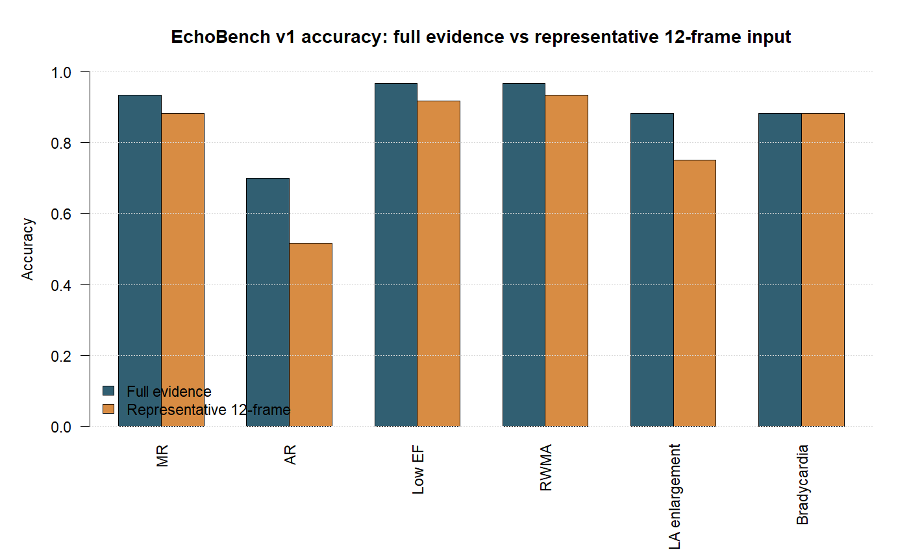
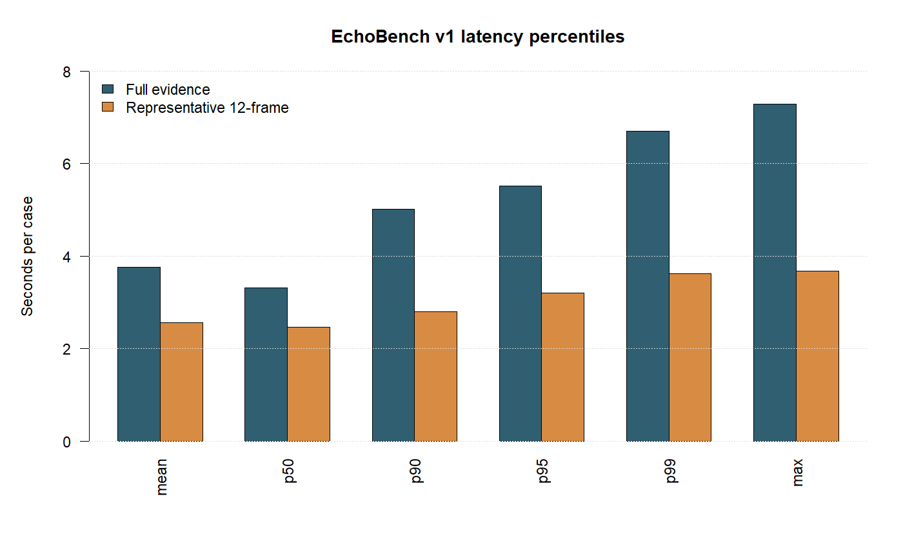
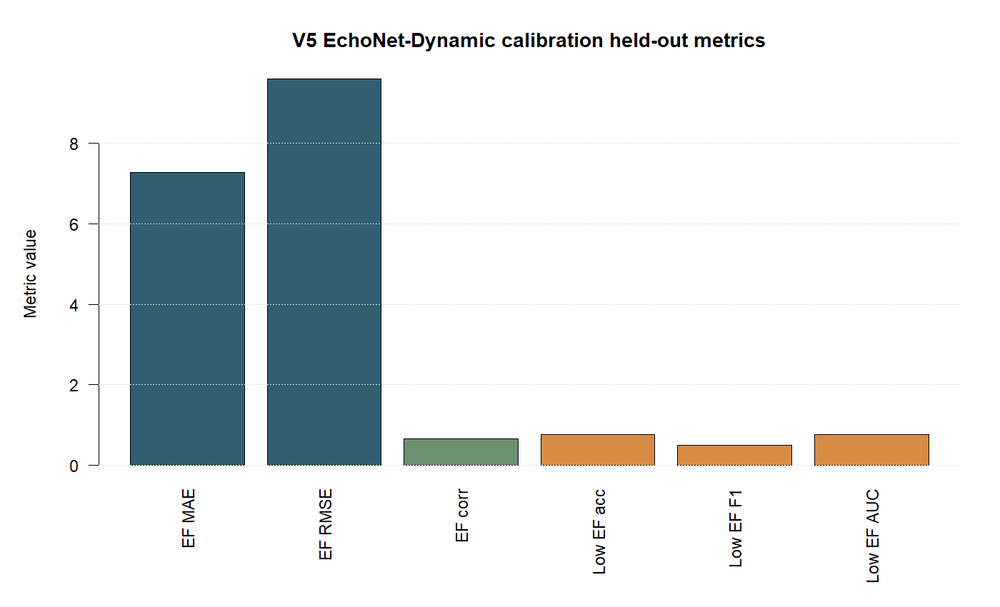

# CardioConsult PC V5 EchoBench 技术报告（APA 引用版）

生成日期：2026-06-04  
系统版本：CardioConsult PC V5 `V5_EchoNet_DL_20260604`  
主运行目录：`<V5_ROOT>`

## 技术摘要

CardioConsult PC V5 面向心脏超声教学参考和基层辅助初筛场景，目标是在普通 PC 上离线读取 PNG、DICOM/DCOM 与超声动图文件，输出“从大方向到最小病症”的结构化疑似诊断文字。V5 在原有 B-mode 纹理、彩色多普勒代理特征、层级标签规则和 Gemma4 4B GGUF 本地报告生成基础上，加入 EchoNet-Dynamic 动态 B-mode 校准层，用于增强左室射血分数（EF）和左室收缩功能减低的识别能力。EchoNet-Dynamic 是公开心脏超声视频基准，包含 10,030 个心尖四腔心超视频及 EF、ESV、EDV 和专家左室追踪标注（Ouyang et al., 2020）。

本次按照 EchoBench v1 重新跑了两组可复现 benchmark：一组使用 60 例授权本地 DICOM/报告映射数据的完整可用文件，另一组使用每例最多 12 个代表性文件/帧，模拟产品标准输入上限。完整证据场景 60/60 例成功，平均 3.76 秒/例；12 帧代表抽样场景 60/60 例成功，平均 2.56 秒/例。完整证据场景中，二尖瓣反流（MR）F1 为 0.964，主动脉瓣反流（AR）F1 为 0.700，低 EF F1 为 0.857；12 帧场景中 MR F1 为 0.936，低 EF F1 为 0.615，AR F1 降至 0.326。结果说明：V5 已经能在低成本本地硬件上保持稳定吞吐，但主动脉瓣反流、区域室壁运动异常、左房扩大等标签仍强依赖切面覆盖和报告标签密度。

V5 的主要改进不是把所有任务改成一个黑盒深度网络，而是采用“可审计边缘特征 + 小模型校准 + 本地 LLM 文本生成”的混合结构。这一取舍符合医疗 AI 良好机器学习实践中关于目标人群、数据代表性、可追溯开发流程和性能监测的原则（FDA, Health Canada, & MHRA, 2021），也更适合离线部署、低成本演示和敏感数据不出本地的项目约束。

## 关键结果与图表证据

### 完整证据场景下，瓣膜反流主标签表现稳定，低 EF 被 V5 校准显著补强

完整证据场景使用每例所有可用文件，平均 17.3 个文件/例，最多 33 个文件/例。该场景代表资料相对充分时的系统能力上限。MR 的准确率为 0.933、敏感性 0.964、特异性 0.600、F1 0.964；TR 数据集在本批 60 例中全部为阳性，因此 F1 为 1.000，但特异性没有统计意义；AR 准确率为 0.700、敏感性 0.724、特异性 0.677、F1 0.700。低 EF 标签在完整证据场景中准确率为 0.967、敏感性 1.000、特异性 0.963、F1 0.857。


图 1 显示，V5 对 MR 和低 EF 的 F1 保持在可用于教学演示的水平；AR、RWMA、LA enlargement 在资料减少时下降明显，提示这几类标签需要更多切面、动态帧或更强结构化标注支持。该结果与超声实践一致：瓣膜反流严重程度和腔室大小判断依赖多切面、多参数综合评估，而不能只从单帧或单切面稳定推断（Lang et al., 2015; Zoghbi et al., 2017）。

| 标签 | n | 阳性金标准 | TP | TN | FP | FN | 准确率 | 敏感性 | 特异性 | F1 |
| --- | ---: | ---: | ---: | ---: | ---: | ---: | ---: | ---: | ---: | ---: |
| 二尖瓣反流（MR） | 60 | 55 | 53 | 3 | 2 | 2 | 0.933 | 0.964 | 0.600 | 0.964 |
| 三尖瓣反流（TR） | 60 | 60 | 60 | 0 | 0 | 0 | 1.000 | 1.000 | 0.000* | 1.000 |
| 主动脉瓣反流（AR） | 60 | 29 | 21 | 21 | 10 | 8 | 0.700 | 0.724 | 0.677 | 0.700 |
| 低 EF / 左室收缩功能减低 | 60 | 6 | 6 | 52 | 2 | 0 | 0.967 | 1.000 | 0.963 | 0.857 |
| 区域室壁运动异常（RWMA） | 60 | 3 | 1 | 57 | 0 | 2 | 0.967 | 0.333 | 1.000 | 0.500 |
| 左房扩大 | 60 | 8 | 8 | 45 | 7 | 0 | 0.883 | 1.000 | 0.865 | 0.696 |

注：TR 在本批测试集中没有阴性样本，因此特异性不能作为有效结论。

### 12 帧代表抽样更接近演示输入上限，但会牺牲部分细粒度病症定位

12 帧场景将每例文件做均匀代表抽样，而不是只取前 12 个文件。这样可以避免早期文件顺序导致的系统性偏差。该场景平均 2.56 秒/例，适合现场演示和普通 PC 快速批量验证。MR 准确率为 0.883、F1 0.936；低 EF 准确率为 0.917、F1 0.615；AR 准确率为 0.517、F1 0.326。AR 降幅最大，说明主动脉瓣反流更容易受切面缺失、彩色多普勒覆盖不足和代表帧抽样影响。



| 标签 | n | 阳性金标准 | TP | TN | FP | FN | 准确率 | 敏感性 | 特异性 | F1 |
| --- | ---: | ---: | ---: | ---: | ---: | ---: | ---: | ---: | ---: | ---: |
| 二尖瓣反流（MR） | 60 | 55 | 51 | 2 | 3 | 4 | 0.883 | 0.927 | 0.400 | 0.936 |
| 三尖瓣反流（TR） | 60 | 60 | 60 | 0 | 0 | 0 | 1.000 | 1.000 | 0.000* | 1.000 |
| 主动脉瓣反流（AR） | 60 | 29 | 7 | 24 | 7 | 22 | 0.517 | 0.241 | 0.774 | 0.326 |
| 低 EF / 左室收缩功能减低 | 60 | 6 | 4 | 51 | 3 | 2 | 0.917 | 0.667 | 0.944 | 0.615 |
| 区域室壁运动异常（RWMA） | 60 | 3 | 1 | 55 | 2 | 2 | 0.933 | 0.333 | 0.965 | 0.333 |
| 左房扩大 | 60 | 8 | 3 | 42 | 10 | 5 | 0.750 | 0.375 | 0.808 | 0.286 |

注：12 帧场景不是用于证明所有病症的最终性能，而是用于评估输入受限时的稳定性。

### 本地 PC 延迟满足交互式教学演示，GGUF 生成建议使用常驻 server 方式

完整证据场景平均 3.76 秒/例，P95 为 5.51 秒；12 帧场景平均 2.56 秒/例，P95 为 3.20 秒。该速度来自规则与小模型校准流水线，不包含每例完整 GGUF 文本生成。Gemma4 4B GGUF 的 `llama-bench` 结果为 prompt processing 37.76 tokens/s、token generation 6.19 tokens/s；`llama-server` 冷启动首个 completion 约 8.78 秒，热启动第二个 completion 约 0.49 秒。因此 UI 演示建议启动常驻 server，再让 V5 把已结构化的特征和标签摘要交给本地模型生成最终教学解释。



| 场景 | 成功例数 | 平均秒/例 | P50 | P90 | P95 | P99 | 最大值 | 平均文件数/例 |
| --- | ---: | ---: | ---: | ---: | ---: | ---: | ---: | ---: |
| 完整证据 | 60/60 | 3.761 | 3.311 | 5.012 | 5.513 | 6.704 | 7.282 | 17.283 |
| 12 帧代表抽样 | 60/60 | 2.562 | 2.471 | 2.796 | 3.201 | 3.624 | 3.680 | 12.000 |

| GGUF/llama.cpp 指标 | 结果 |
| --- | ---: |
| GGUF 文件 | `gemma-4-4b-it-Q4_K_M.gguf` |
| SHA256 | `519b9793ed6ce0ff530f1b7c96e848e08e49e7af4d57bb97f76215963a54146d` |
| llama.cpp build | `b9469` |
| CPU threads | 14 |
| prompt processing | 37.76 tokens/s |
| generation | 6.19 tokens/s |
| server 首次 completion | 8.775 s |
| server 热启动 completion | 0.492 s |

性能测量方式借鉴 MLPerf 对离线、单流和服务端场景的拆分思想，但 EchoBench v1 是项目自建 benchmark，不是 MLPerf 官方提交结果（MLCommons, n.d.-a, n.d.-b）。

## 范围、数据与指标定义

### 系统输入与输出

V5 保留 PC 版输入输出契约：输入支持 PNG/JPG、DICOM/DCOM、GIF、AVI/MP4/MOV 等图片或动图文件；单例输入可包含少量收缩/舒张态图像，也可包含最多标准心脏超声 12 个体位或多段动态文件。系统自动抽取代表帧、估计收缩/舒张相位、计算 B-mode 与彩色多普勒特征，并输出一段中文教学参考诊断。输出必须包含大方向、中方向、小方向/具体问题和最小病症，例如“瓣膜性心脏病 > 二尖瓣异常 > 轻度二尖瓣反流”。当证据不足以定位具体瓣膜时，系统应明确说明“定位证据不足”，但仍给出最小可支持的教学标签。

### 本地授权 60 例数据

本次 EchoBench v1 主测试集来自 `D:\new training dataset` 归档后的 DICOM 与报告时间映射，映射文件为：

`<V4_ROOT>\03_mapping\case_report_time_mapping.csv`

测试集包含 60 个病例，每个病例已用报告时间与影像时间对应，并提取脱敏教学标签。该数据只用于本地授权教育验证，不随代码发布，不作为公开数据集再分发。报告标签被用作当前 benchmark 的“报告链接金标准”，但它不是独立多专家盲法复核金标准。

### EchoNet-Dynamic 数据

V5 新增使用 EchoNet-Dynamic 公开数据进行动态 B-mode EF 校准。实际读取内容包括：

| 文件/目录 | 本地计数与用途 |
| --- | --- |
| `Videos` | 10,030 个 `.avi` 心尖四腔视频 |
| `FileList.csv` | 10,030 行，含 EF、ESV、EDV、FPS、帧数、官方 split |
| `VolumeTracings.csv` | 专家左室追踪帧，用于动态结构线索参考 |

训练使用官方 split 的子集：train 1,200、validation 300、test 300，每个视频最多采样 16 帧。EchoNet-Dynamic 原论文使用视频深度学习对心功能进行逐搏评估，并报告该数据集可支持 EF、左室容积和专家追踪相关任务（Ouyang et al., 2020）。本项目没有把 EchoNet-Dynamic 用作瓣膜反流训练集，因为该数据集主要服务 A4C B-mode 心功能任务，不提供 MR/TR/AR 分级标签。

### 评价指标

分类任务使用准确率、敏感性、特异性、精确率和 F1。对于全阳性或全阴性标签，特异性或敏感性不具备正常解释，需要在报告中单独标注。回归任务使用 MAE、RMSE 和相关系数。延迟使用 mean、P50、P90、P95、P99、max 和标准差。文本质量当前以结构化标签命中和安全提示完整性为主，后续应引入类似 HealthBench 的医师 rubric 评分方式，对医疗文本的事实性、完整性、风险提示和边界表达进行盲法评分（OpenAI, 2025）。

## 方法：可审计特征、小模型校准与本地 LLM 生成

### B-mode 与动图处理

B-mode 分支保留 SRAD/CLAHE 风格的去噪增强、边缘密度、纹理熵、散斑残差、对比增益、腔室面积代理和收缩/舒张面积差。对于动图输入，V5 计算代表帧序列的时间差分、暗腔区域变化、质心漂移、宽高变化和低维缩略图特征。该设计不试图替代临床 Simpson 双平面法，而是为低成本本地模型提供可解释的动态代理信号。左室腔室量化和 EF 的临床标准仍应参考正式超声指南（Lang et al., 2015）。

### 彩色多普勒处理

Color Doppler 分支使用 HSV 颜色向量化和连通域过滤，提取活跃区比例、最大连通域占比、喷流宽度代理、方向一致性、湍流代理和涡量代理。该分支用于支持瓣膜反流教学标签，但当前仍是“代理特征”，不能替代正式多参数反流定量。瓣膜反流严重程度的临床判断应综合喷流、PISA、vena contracta、肺静脉/肝静脉血流、连续波多普勒和腔室反应等多参数（Zoghbi et al., 2017）。

### V5 EchoNet-Dynamic 校准层

V5 的特征向量长度为 825。候选模型包括 Ridge 回归、HistGradientBoostingRegressor、MLPRegressor、LogisticRegression、HistGradientBoostingClassifier、RandomForestClassifier 和 MLPClassifier。最终按验证集指标选择：

| 子任务 | 选中模型 | 选择依据 |
| --- | --- | --- |
| EF 回归 | HistGradientBoostingRegressor | 验证集 MAE/RMSE 优于 Ridge 与 MLP |
| 低 EF 分类 | LogisticRegression | 验证集 F1 最优，AUC 接近树模型，推理更轻 |

深度学习候选模型被训练和评估，但没有被强行采用。这个结果说明：在当前 CPU、本地离线和小样本预算下，轻量可解释模型反而能提供更稳定的校准收益。V5 的设计目标是把深度数据集引入到可运行系统中，而不是牺牲部署可行性去追求不可复现的大模型结构。



| EchoNet-Dynamic held-out 指标 | 数值 |
| --- | ---: |
| EF MAE | 7.271 |
| EF RMSE | 9.603 |
| EF 相关系数 | 0.647 |
| 低 EF 准确率 | 0.770 |
| 低 EF 精确率 | 0.479 |
| 低 EF 召回率 | 0.515 |
| 低 EF F1 | 0.496 |
| 低 EF AUC | 0.764 |

该 held-out 结果支持把 V5 校准层用于“左室收缩功能减低的教学提示”，但不足以把系统宣称为临床 EF 自动测量工具。

### Gemma4 4B GGUF 本地生成

V5 使用原 PC 版 GGUF 文件，路径为：

`D:\cardioconsult_PC_runbook\models\gemma-4-4b-it-Q4_K_M.gguf`

GGUF 是 llama.cpp 生态常用的单文件量化模型格式，便于在本地 CPU/GPU 环境加载和分发（ggml-org, n.d.）。Gemma 开放模型家族的端侧尺寸和本地部署背景参考 Google AI for Developers 文档（Google AI for Developers, n.d.）。V5 把 LLM 放在诊断文本生成后段：规则与校准模型先生成结构化标签、证据和安全分层，再由本地模型组织为中文教学报告。这样可以降低 LLM 幻觉对核心标签的影响，并保留审计链路。

## Benchmark 设计

EchoBench v1 被设计为项目级 benchmark，而不是单脚本 smoke test。它包含三类场景：

| 场景 | 状态 | 测量目的 |
| --- | --- | --- |
| S1 SingleStudy Interactive | 预留 | 单例 UI 上传、实时输出、可选 GGUF 报告 |
| S2 OfflineBatch | 已运行 | 批量病例、每例延迟、标签准确率、吞吐 |
| S3 PersistentServer | 部分运行 | llama-server 冷/热启动、GGUF tokens/s、端到端文本生成 |

本次主报告使用 S2 完整证据、S2 12 帧代表抽样和 S3 GGUF smoke。Benchmark 思路参考 MLPerf Client 对 PC 本地 AI 工作负载的关注，以及 MLPerf Inference 对不同部署场景性能度量的拆分；医疗 AI 的多中心、隐私保留和可复核评估框架则参考 MedPerf 的联邦评估思想（MLCommons, n.d.-a, n.d.-b, n.d.-c）。

## 与现有方案的比较

### 现有公开心超 AI 方案

EchoNet-Dynamic 证明了心超视频深度学习可以对 EF 和左室功能进行高质量估计，并提供公开数据与代码入口（Ouyang et al., 2020）。CAMUS 提供了大规模 2D 心超分割数据，可用于左室、心肌和左房结构分割研究（Leclerc et al., 2019）。这些方案的优势是深度学习任务定义清晰、公开基准强、适合学术复现；限制是它们通常聚焦单一任务，例如 EF、容积或分割，不直接覆盖基层教学所需的多标签疑似诊断、DICOM/DCOM 输入兼容、离线中文报告生成和低成本 PC/移动端部署。

### CardioConsult V5 的差异化

V5 的优势在于整合能力和部署成本：

1. 输入侧保留 PNG、DICOM/DCOM 和动图兼容，不要求用户先把超声文件转换成单一研究格式。
2. 算法侧同时包含 B-mode、Color Doppler、动图时间差分和 EchoNet 校准，不只看单帧纹理。
3. 输出侧强制层级诊断和最小病症字段，适合教学复盘和基层转诊前参考。
4. 推理侧使用本地规则、小模型和 GGUF LLM，边际调用成本接近 0，敏感图像不需要上传云端。

代价是 V5 当前准确率仍依赖切面覆盖和规则标签质量，不能与专门训练的大型医学影像模型在单任务公开排行榜上直接竞争。更合理的定位是“低成本、本地可运行、可审计、多输入格式、多标签教学辅助系统”。

## 成本模型

V5 的成本结构主要是一次性硬件和模型文件成本，运行时不需要按病例调用云 API。以当前 PC benchmark 为例，完整证据场景平均 3.76 秒/例，理论规则流水线吞吐约 957 例/小时；12 帧场景平均 2.56 秒/例，理论吞吐约 1,405 例/小时。真实 UI 使用会受人工选文件、磁盘读取、DICOM 解码和 GGUF 文本生成影响，因此演示吞吐应按更保守数值估计。

如果按云端多模态/LLM API 实现，成本通常随病例数线性增长，并涉及医学图像上传、网络可用性、合规审查和服务中断风险。V5 本地方案牺牲了部分云端大模型能力，但换取低边际成本、离线可用、部署可复制和数据不出本地的优势。对基层和教学场景，这种成本结构更接近实际需求。

## 取舍与工程判断

### 准确率与可部署性的取舍

端到端大型视频模型可能在 EF 或分割任务上更强，但会带来 GPU/NPU 依赖、模型体积、训练时间和移动端迁移成本。V5 选择小模型校准和规则融合，是为了确保普通 PC 可跑、移动端后续可迁移，并且每条诊断都有特征证据和规则路径可追踪。

### 完整证据与标准 12 帧输入的取舍

完整证据可以提高 AR、LA enlargement 和低 EF 等标签的稳定性，但用户现场输入往往受文件数量、切面质量和时间限制影响。12 帧代表抽样降低延迟和内存占用，但会损失部分病症定位能力。V5 因此在输出中保留“证据充分度”和“建议补扫切面”，而不是在证据不足时假装高置信度。

### LLM 解释能力与安全边界的取舍

LLM 能把结构化证据组织成更自然的中文报告，但医疗文本必须控制幻觉风险。V5 把最小病症、分级、证据和安全分层放在规则/校准层生成，再让 LLM 做表达增强。这比让 LLM 直接从图像特征自由诊断更可审计，也更符合医疗 AI 输出应有的边界。

## 限制、不确定性与鲁棒性

1. 本地 60 例测试集规模有限，且来自授权本地数据，不是公开多中心盲法验证集。
2. 报告链接标签是当前 benchmark 的金标准，但不是 2-3 位超声专家独立盲评后的共识标签。
3. TR 在本批数据中全为阳性，不能解释特异性；PR 和 severe 标签样本不足，不能做有效结论。
4. EchoNet-Dynamic 只增强 A4C B-mode 心功能相关任务，不提供瓣膜反流分级监督。
5. AR、RWMA 和左房扩大在 12 帧抽样下降明显，说明未来必须增强切面识别、动图分割和标签平衡。
6. GGUF 文本生成速度在 CPU 上受 token 数影响较大，正式演示应使用常驻 server，避免每例冷启动。
7. 本系统是医学教学和算法演示工具，不是医疗器械输出，不应作为正式临床诊断、治疗建议或医嘱。

## 推荐下一步

1. 建立专家盲评表：每例输出由 2-3 位心超医生按病症定位、分级、证据完整性、安全提示和教学价值评分，计算 Cohen's Kappa、加权 Kappa 或 ICC。
2. 扩展低样本标签：优先补充 AR、PR、severe regurgitation、RWMA、LVH/HCM、LA enlargement 的阳性和阴性平衡样本。
3. 引入轻量分割模型：用 CAMUS 或 EchoNet tracing 训练 ONNX/TFLite 左室/左房分割模型，作为 V6 的 EF 与腔室大小更稳定输入。
4. 增强切面识别：将 PLAX、PSAX、A4C、A2C、subcostal 等基础切面作为显式中间任务，降低“体位覆盖 1 个”时的定位不确定性。
5. 完善正式 EchoBench：固定数据版本、病例清单、模型哈希、硬件信息、命令行、输出 CSV、图表和统计检验，形成每次提交可复跑的 benchmark 包。

## 可复现信息

| 项目 | 值 |
| --- | --- |
| V5 根目录 | `<V5_ROOT>` |
| PC 应用目录 | `<V5_ROOT>\05_pc_v5` |
| Benchmark 主目录 | `<V5_ROOT>\08_benchmark_framework` |
| 完整证据 run | `runs\echobench_20260604_114319` |
| 12 帧 run | `runs\echobench_20260604_114016` |
| EchoNet 训练报告 | `training\echonet_v5\training_report.json` |
| GGUF 模型 | `D:\cardioconsult_PC_runbook\models\gemma-4-4b-it-Q4_K_M.gguf` |
| GGUF SHA256 | `519b9793ed6ce0ff530f1b7c96e848e08e49e7af4d57bb97f76215963a54146d` |
| R 图表脚本 | `reports\make_benchmark_figures.R` |

核心重跑命令：

```powershell
<V5_ROOT>\05_pc_v5\.venv\Scripts\python.exe tools\run_echobench_v1.py --mapping <V4_ROOT>\03_mapping\case_report_time_mapping.csv --out-root <V5_ROOT>\08_benchmark_framework\runs --hash-model
```

```powershell
<V5_ROOT>\05_pc_v5\.venv\Scripts\python.exe tools\run_echobench_v1.py --mapping <V4_ROOT>\03_mapping\case_report_time_mapping.csv --out-root <V5_ROOT>\08_benchmark_framework\runs --hash-model --max-files-per-case 12
```

## 参考文献

FDA, Health Canada, & Medicines and Healthcare products Regulatory Agency. (2021). *Good machine learning practice for medical device development: Guiding principles*. https://www.gov.uk/government/publications/good-machine-learning-practice-for-medical-device-development-guiding-principles

ggml-org. (n.d.). *GGUF file format - llama.cpp*. Retrieved June 4, 2026, from https://www.mintlify.com/ggml-org/llama.cpp/concepts/gguf-format

Google AI for Developers. (n.d.). *Get started with Gemma models*. Retrieved June 4, 2026, from https://ai.google.dev/gemma/docs/get_started

Lang, R. M., Badano, L. P., Mor-Avi, V., Afilalo, J., Armstrong, A., Ernande, L., Flachskampf, F. A., Foster, E., Goldstein, S. A., Kuznetsova, T., Lancellotti, P., Muraru, D., Picard, M. H., Rietzschel, E. R., Rudski, L., Spencer, K. T., Tsang, W., & Voigt, J.-U. (2015). Recommendations for cardiac chamber quantification by echocardiography in adults: An update from the American Society of Echocardiography and the European Association of Cardiovascular Imaging. *Journal of the American Society of Echocardiography, 28*(1), 1-39.e14. https://doi.org/10.1016/j.echo.2014.10.003

Leclerc, S., Smistad, E., Pedrosa, J., Østvik, A., Cervenansky, F., Espinosa, F., Espeland, T., Berg, E. A. R., Jodoin, P.-M., Grenier, T., Lartizien, C., Dhooge, J., Lovstakken, L., Bernard, O., & Grenier, T. (2019). Deep learning for segmentation using an open large-scale dataset in 2D echocardiography. *IEEE Transactions on Medical Imaging, 38*(9), 2198-2210. https://doi.org/10.1109/TMI.2019.2900516

MLCommons. (n.d.-a). *MLPerf Client*. Retrieved June 4, 2026, from https://mlcommons.org/benchmarks/client/

MLCommons. (n.d.-b). *MLPerf Inference benchmarks*. Retrieved June 4, 2026, from https://docs.mlcommons.org/inference/

MLCommons. (n.d.-c). *MedPerf: An open benchmarking platform for medical artificial intelligence using federated evaluation*. Retrieved June 4, 2026, from https://github.com/mlcommons/medperf

OpenAI. (2025). *Introducing HealthBench*. https://openai.com/index/healthbench/

Ouyang, D., He, B., Ghorbani, A., Yuan, N., Ebinger, J., Langlotz, C. P., Heidenreich, P. A., Harrington, R. A., Liang, D. H., Ashley, E. A., & Zou, J. Y. (2020). Video-based AI for beat-to-beat assessment of cardiac function. *Nature, 580*(7802), 252-256. https://doi.org/10.1038/s41586-020-2145-8

Zoghbi, W. A., Adams, D., Bonow, R. O., Enriquez-Sarano, M., Foster, E., Grayburn, P. A., Hahn, R. T., Han, Y., Hung, J., Lang, R. M., Little, S. H., Shah, D. J., Shernan, S., Thavendiranathan, P., Thomas, J. D., & Weissman, N. J. (2017). Recommendations for noninvasive evaluation of native valvular regurgitation: A report from the American Society of Echocardiography developed in collaboration with the Society for Cardiovascular Magnetic Resonance. *Journal of the American Society of Echocardiography, 30*(4), 303-371. https://doi.org/10.1016/j.echo.2017.01.007
